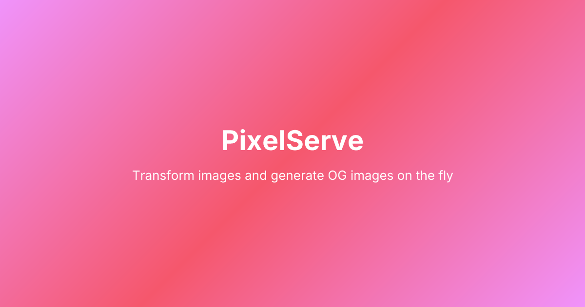

<div align="center">


# PixelServe

A high-performance image processing microservice built with Bun, ElysiaJS, and Sharp. Provides on-the-fly image transformations and dynamic Open Graph image generation via simple URL parameters.

[](https://github.com/climactic/pixelserve/releases)
[](https://ghcr.io/climactic/pixelserve)
[](https://discord.gg/nsZySRkUfQ)
[](https://github.com/sponsors/climactic)
[](LICENSE)

</div>

## Features

- **Image Processing** - Resize, crop, rotate, blur, grayscale, sharpen, and more
- **Format Conversion** - WebP, AVIF, PNG, JPEG, GIF with quality control
- **OG Image Generation** - Dynamic social media images using Satori (no headless browser)
- **Multiple Templates** - 8 built-in templates + JSON-based custom templates
- **Smart Caching** - Disk, memory, or no caching with CDN-friendly headers
- **SSRF Protection** - Blocks private IPs, localhost, and dangerous protocols
- **Type-Safe** - Full TypeScript with Elysia's TypeBox validation

## Quick Start

### Docker (Recommended)

```bash
# Pull and run from GitHub Container Registry
docker pull ghcr.io/climactic/pixelserve:latest
docker run -p 3000:3000 ghcr.io/climactic/pixelserve:latest

# With environment variables
docker run -p 3000:3000 \
  -e CACHE_MODE=disk \
  -e CACHE_DIR=/app/cache \
  -v ./cache:/app/cache \
  ghcr.io/climactic/pixelserve:latest
```

### Docker Compose

```yaml
services:
  pixelserve:
    image: ghcr.io/climactic/pixelserve:latest
    ports:
      - "3000:3000"
    environment:
      - CACHE_MODE=disk
      - CACHE_DIR=/app/cache
    volumes:
      - ./cache:/app/cache
```

### From Source

```bash
# Install dependencies
bun install

# Start the server
bun run dev

# Or production mode
bun run start
```

Server runs at `http://localhost:3000`

## API Endpoints

### Image Processing: `GET /image`

Transform remote images with URL parameters.

```
/image?url=https://example.com/photo.jpg&w=800&h=600&format=webp
```

| Parameter     | Type    | Description                                     |
| ------------- | ------- | ----------------------------------------------- |
| `url`         | string  | **Required.** Source image URL                  |
| `w`           | number  | Width (1-4096)                                  |
| `h`           | number  | Height (1-4096)                                 |
| `fit`         | string  | `cover`, `contain`, `fill`, `inside`, `outside` |
| `position`    | string  | Crop focus point (see table below)              |
| `q`           | number  | Quality (1-100, default: 80)                    |
| `format`      | string  | `webp`, `avif`, `png`, `jpg`, `gif`             |
| `blur`        | number  | Blur sigma (0.3-1000)                           |
| `grayscale`   | boolean | Convert to grayscale                            |
| `rotate`      | number  | Rotation in degrees                             |
| `flip`        | boolean | Flip vertically                                 |
| `flop`        | boolean | Flip horizontally                               |
| `brightness`  | number  | Brightness multiplier (0+)                      |
| `saturation`  | number  | Saturation multiplier (0+)                      |
| `sharpen`     | number  | Sharpen sigma (0+)                              |
| `tint`        | string  | Tint color (hex, e.g., `ff5500`)                |
| `trim`        | boolean | Trim whitespace                                 |
| `crop`        | string  | Crop region `x,y,width,height`                  |
| `watermark`   | string  | Watermark image URL                             |
| `wm_position` | string  | Watermark position (see table below)            |
| `wm_opacity`  | number  | Watermark opacity (0-1)                         |

**Position Values** (for `position` and `wm_position`):

```
┌─────────────┬─────────────┬─────────────┐
│  top-left   │     top     │  top-right  │
├─────────────┼─────────────┼─────────────┤
│    left     │   center    │    right    │
├─────────────┼─────────────┼─────────────┤
│ bottom-left │   bottom    │ bottom-right│
└─────────────┴─────────────┴─────────────┘
```

| Value          | Description                                 |
| -------------- | ------------------------------------------- |
| `center`       | Center of image (default)                   |
| `top`          | Top center                                  |
| `bottom`       | Bottom center                               |
| `left`         | Left center                                 |
| `right`        | Right center                                |
| `top-left`     | Top-left corner                             |
| `top-right`    | Top-right corner                            |
| `bottom-left`  | Bottom-left corner                          |
| `bottom-right` | Bottom-right corner                         |
| `entropy`      | Focus on area with highest detail           |
| `attention`    | Focus on area most likely to draw attention |

**Examples:**

```bash
# Resize to 400px width, auto height, WebP format
/image?url=https://example.com/photo.jpg&w=400&format=webp

# Grayscale with blur
/image?url=https://example.com/photo.jpg&grayscale=true&blur=5

# Crop and rotate
/image?url=https://example.com/photo.jpg&crop=100,100,500,500&rotate=90
```

### OG Image Generation: `GET /og`

Generate Open Graph images for social media sharing.

```
/og?title=Hello%20World&description=My%20awesome%20page&template=gradient
```

| Parameter     | Type   | Description                                      |
| ------------- | ------ | ------------------------------------------------ |
| `title`       | string | Main title text (max 200 chars)                  |
| `description` | string | Description text (max 500 chars)                 |
| `template`    | string | Template name (see below)                        |
| `font`        | string | Font family name (any Google Font)               |
| `config`      | string | Inline template config (base64/URL-encoded JSON) |
| `bg`          | string | Background color (hex)                           |
| `fg`          | string | Text color (hex)                                 |
| `titleColor`  | string | Title-specific color (hex)                       |
| `descColor`   | string | Description-specific color (hex)                 |
| `accentColor` | string | Accent color (hex)                               |
| `image`       | string | Background image URL                             |
| `logo`        | string | Logo image URL                                   |
| `w`           | number | Width (100-2400, default: 1200)                  |
| `h`           | number | Height (100-1260, default: 630)                  |

**Built-in Templates:**

| Template   | Description                                          |
| ---------- | ---------------------------------------------------- |
| `default`  | Clean centered layout with optional background image |
| `gradient` | Modern gradient background with glassmorphism card   |
| `modern`   | Dark theme with colorful accent stripe at top        |
| `minimal`  | Ultra clean minimal design on white background       |
| `brand`    | Professional layout with side accent panel           |
| `blog`     | Blog post style with category tag                    |
| `dark`     | Sleek dark mode with subtle gradient orbs            |
| `split`    | Split layout - content left, image right             |

**Dynamic Fonts:**

Any [Google Font](https://fonts.google.com/) can be used via the `font` parameter. Fonts are loaded dynamically from [Coolify Fonts](https://fonts.coollabs.io/) (a privacy-friendly Google Fonts proxy) and cached locally.

```bash
# Use Poppins font
/og?title=Hello&font=Poppins

# Use Playfair Display (encode spaces with +)
/og?title=Hello&font=Playfair+Display

# Combine with templates
/og?title=Hello&template=modern&font=Montserrat
```

**Suggested Fonts:** Inter (default), Roboto, Open Sans, Lato, Montserrat, Poppins, Playfair Display, Merriweather, Nunito, Raleway, Ubuntu, Oswald

**Examples:**

```bash
# Basic OG image
/og?title=My%20Blog%20Post&description=A%20great%20article

# With gradient template
/og?title=Product%20Launch&template=gradient&bg=667eea

# Custom colors
/og?title=Hello&titleColor=ff5500&descColor=888888&bg=1a1a2e

# With logo
/og?title=Acme%20Inc&logo=https://example.com/logo.png&template=brand
```

### List Templates: `GET /og/templates`

Returns available templates and usage information.

### Health Check: `GET /health`

Returns server health status and cache statistics.

## Configuration

Configure via environment variables:

```bash
# Server
PORT=3000

# Caching
CACHE_MODE=disk          # disk, memory, hybrid, or none
CACHE_DIR=./cache
CACHE_TTL=86400          # 24 hours
MAX_CACHE_SIZE=1073741824  # 1GB
MAX_MEMORY_CACHE_ITEMS=1000

# Security
ALLOWED_DOMAINS=         # Comma-separated source image domains (empty = allow all)
ALLOWED_ORIGINS=         # Comma-separated CORS origins (empty = allow all)
MAX_IMAGE_SIZE=10485760  # 10MB
REQUEST_TIMEOUT=30000    # 30 seconds

# Browser/CDN Cache
BROWSER_CACHE_TTL=31536000  # 1 year

# Custom templates
TEMPLATES_DIR=./templates
```

## Custom Templates

Create JSON template files in the `templates/` directory:

```json
{
  "name": "company",
  "description": "Professional company branding template",
  "layout": {
    "backgroundColor": "#{{bg}}",
    "fontFamily": "Montserrat",
    "padding": 80,
    "direction": "column",
    "align": "start",
    "justify": "center",
    "elements": [
      {
        "type": "image",
        "src": "{{logo}}",
        "width": 64,
        "height": 64,
        "showIf": "logo"
      },
      {
        "type": "text",
        "content": "{{title}}",
        "fontSize": 64,
        "fontWeight": 700,
        "color": "#{{titleColor}}"
      },
      {
        "type": "text",
        "content": "{{description}}",
        "fontSize": 28,
        "color": "#{{descColor}}",
        "showIf": "description"
      }
    ]
  }
}
```

**Template Variables:**

- `{{title}}` - Title text
- `{{description}}` - Description text
- `{{bg}}` - Background color (falls back to default)
- `{{fg}}` - Foreground/text color
- `{{titleColor}}` - Title color (falls back to `fg`)
- `{{descColor}}` - Description color (falls back to `titleColor`)
- `{{logo}}` - Logo URL
- `{{image}}` - Background image URL

**Element Types:**

- `text` - Text element with fontSize, fontWeight, color, lineHeight, maxWidth, opacity
- `image` - Image element with src, width, height, borderRadius
- `spacer` - Spacing element with size
- `box` - Container with children, backgroundColor, padding, direction, align, justify

**Conditional Rendering:**

Use `showIf` to conditionally render elements:

```json
{
  "type": "text",
  "content": "{{description}}",
  "showIf": "description"
}
```

## Inline Templates

Instead of creating template files, you can pass the entire template configuration directly in the URL using the `config` parameter. This is useful for dynamic templates without server-side files.

**Encoding Options:**

1. **Base64** (recommended for complex templates):
   ```bash
   # Encode your template
   echo '{"layout":{"elements":[{"type":"text","content":"{{title}}","fontSize":48}]}}' | base64

   # Use in URL
   /og?config=eyJsYXlvdXQiOnsiZWxlbWVudHMiOlt7InR5cGUiOiJ0ZXh0IiwiY29udGVudCI6Int7dGl0bGV9fSIsImZvbnRTaXplIjo0OH1dfX0=&title=Hello
   ```

2. **URL-safe Base64** (uses `-` and `_` instead of `+` and `/`):
   ```bash
   /og?config=eyJsYXlvdXQiOnsiZWxlbWVudHMiOlt7InR5cGUiOiJ0ZXh0IiwiY29udGVudCI6Int7dGl0bGV9fSIsImZvbnRTaXplIjo0OH1dfX0-&title=Hello
   ```

3. **URL-encoded JSON**:
   ```bash
   /og?config=%7B%22layout%22%3A%7B%22elements%22%3A%5B%7B%22type%22%3A%22text%22%2C%22content%22%3A%22%7B%7Btitle%7D%7D%22%7D%5D%7D%7D&title=Hello
   ```

**Example: Inline Gradient Template**

```javascript
const template = {
  layout: {
    backgroundGradient: "linear-gradient(135deg, #667eea 0%, #764ba2 100%)",
    padding: 60,
    direction: "column",
    align: "center",
    justify: "center",
    elements: [
      {
        type: "text",
        content: "{{title}}",
        fontSize: 56,
        fontWeight: 700,
        color: "#ffffff"
      },
      {
        type: "spacer",
        size: 20,
        showIf: "description"
      },
      {
        type: "text",
        content: "{{description}}",
        fontSize: 24,
        color: "#ffffff",
        opacity: 0.9,
        showIf: "description"
      }
    ]
  }
};

// Encode and use
const config = btoa(JSON.stringify(template));
const url = `/og?config=${config}&title=My%20Page&description=Welcome`;
```

> **Note:** The `config` parameter takes priority over the `template` parameter. Max config length is 10,000 characters.

## Testing

```bash
# Run all tests
bun test

# Run unit tests only
bun test tests/unit

# Run integration tests only
bun test tests/integration
```

**Test Coverage:**

- URL validation & SSRF prevention
- Cache key generation & headers
- Image processing transformations
- Custom template rendering
- API endpoint integration

## Project Structure

```
pixelserve/
├── src/
│   ├── index.ts              # Main server
│   ├── config.ts             # Environment configuration
│   ├── routes/
│   │   ├── image.ts          # Image processing endpoint
│   │   ├── og.ts             # OG image generation endpoint
│   │   └── health.ts         # Health check
│   ├── services/
│   │   ├── image-processor.ts # Sharp transformations
│   │   ├── image-fetcher.ts  # Remote image fetching
│   │   ├── cache.ts          # Disk/memory caching
│   │   ├── og-generator.ts   # Satori + resvg OG generation
│   │   ├── custom-templates.ts # JSON template builder
│   │   └── fonts.ts          # Dynamic font loading via Coolify Fonts
│   ├── utils/
│   │   ├── url-validator.ts  # SSRF prevention
│   │   └── errors.ts         # Custom error classes
│   └── types/
│       └── index.ts          # TypeScript interfaces
├── cache/                    # Disk cache (gitignored)
├── fonts/                    # Fonts for OG generation
├── templates/                # Custom JSON templates
└── tests/
    ├── unit/
    └── integration/
```

## Security

- **SSRF Prevention**: Blocks `localhost`, `127.0.0.1`, `0.0.0.0`, `::1`, private IP ranges, and `file://` protocol
- **Input Validation**: TypeBox schemas validate all query parameters
- **Size Limits**: Max image dimensions (4096x4096) and file size (10MB)
- **Timeout**: 30-second request timeout prevents hanging connections
- **Domain Allowlist**: Optional `ALLOWED_DOMAINS` to restrict source URLs

## Performance

- **Bun Runtime**: Fast JavaScript/TypeScript runtime
- **Sharp**: Native libvips bindings for image processing
- **Satori**: SVG-based OG generation (no headless browser)
- **Smart Caching**: SHA256-hashed keys with sharded directory structure
- **CDN-Friendly**: `Cache-Control: public, max-age=31536000, immutable`

## Community

Join our Discord community for support, feature requests, and discussions:

[](https://discord.gg/nsZySRkUfQ)

## License

[AGPLv3](LICENSE)
